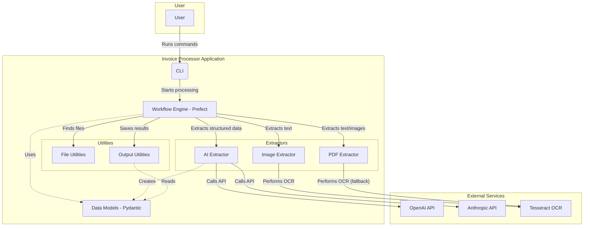
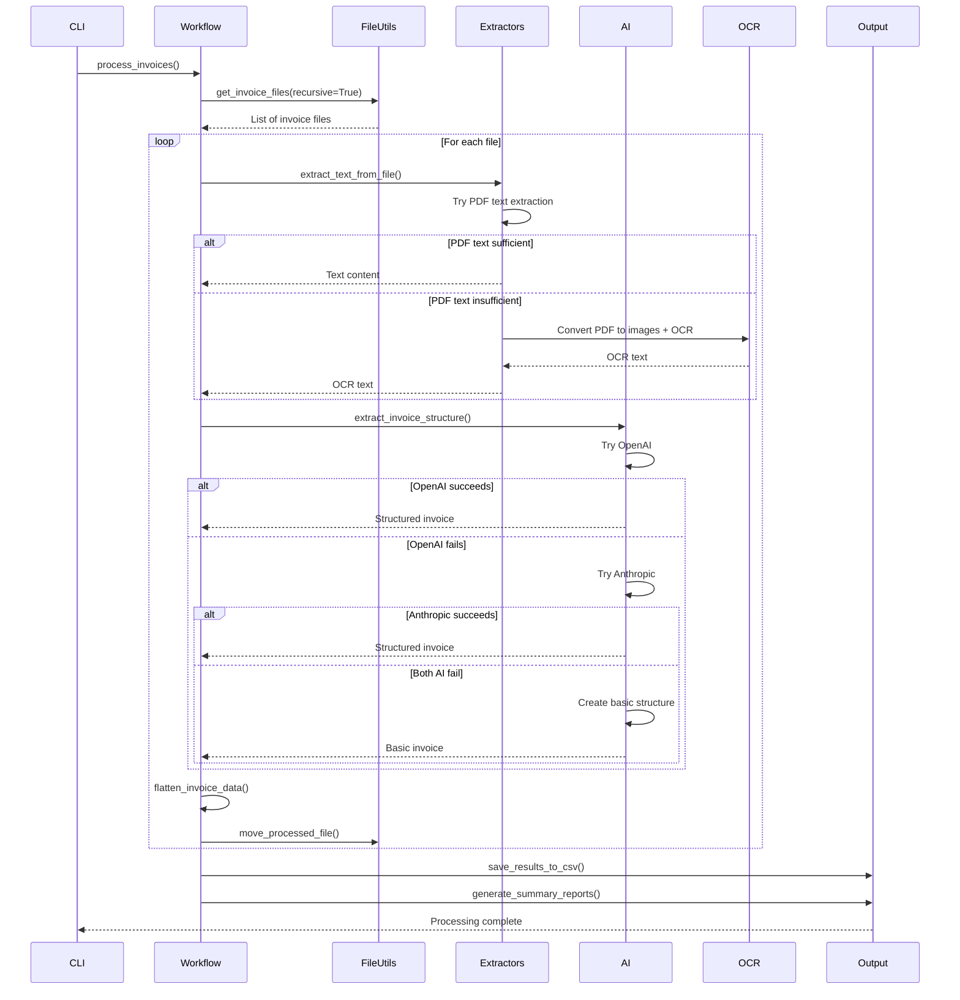

# Invoice Processing Application

A modern, AI-powered invoice processing system built with Python, Prefect workflows, and GenAI models. This application automatically extracts structured data from PDF and image invoices, outputting normalized CSV data with comprehensive reporting.

## 🚀 Features

### Core Functionality
- **Multi-format Support**: Process PDF files and images (PNG, JPEG, TIFF, BMP)
- **AI-Powered Extraction**: Uses OpenAI GPT and Anthropic Claude for intelligent data extraction
- **OCR Fallback**: Tesseract OCR for text extraction when AI fails
- **Recursive Directory Processing**: Automatically processes invoices in nested subdirectories
- **Prefect Workflows**: Robust, scalable workflow orchestration with retry logic
- **Rich CLI**: Beautiful command-line interface with progress indicators

### Advanced Features
- **Structured Output**: Flattened CSV format with header data repeated for each line item
- **Comprehensive Reporting**: Automatic generation of processing summaries and analytics
- **Directory Structure Preservation**: Maintains original folder organization in processed files
- **Error Handling**: Graceful handling of corrupted files, API failures, and processing errors
- **Intelligent Fallbacks**: AI → OCR → Basic structure creation for maximum processing success
- **Multi-provider AI Support**: Primary/fallback configuration with OpenAI and Anthropic

## 📋 Prerequisites

- Python 3.9+
- Poetry for dependency management
- Tesseract OCR installed on your system
- OpenAI API key and/or Anthropic API key (optional but recommended)

### Installing Tesseract

**Ubuntu/Debian:**
```bash
sudo apt-get install tesseract-ocr
```

**macOS:**
```bash
brew install tesseract
```

**Windows:**
Download from: https://github.com/UB-Mannheim/tesseract/wiki

## 🛠️ Installation

### Quick Start (Recommended)

1. **Clone the repository:**
```bash
git clone https://github.com/vallabhallm/invoice_to_excel_v1.git
cd invoice_to_excel_v1
```

2. **Quick setup:**
```bash
./quickstart.sh
```

3. **Run tests:**
```bash
poetry run pytest
```

4. **Start processing invoices:**
```bash
poetry run invoice-processor process
```

### Manual Installation

1. **Install Poetry (if not already installed):**
```bash
curl -sSL https://install.python-poetry.org | python3 -
```

2. **Install dependencies:**
```bash
poetry install
```

3. **Activate the virtual environment:**
```bash
poetry shell
```

4. **Setup the application:**
```bash
invoice-processor setup
```

5. **Configure API keys:**
Edit the `.env` file and add your AI API keys:
```env
OPENAI_API_KEY=your_openai_api_key_here
ANTHROPIC_API_KEY=your_anthropic_api_key_here
```

## 🎯 Usage

### Basic Usage

1. **Place invoice files** in the `data/input/` directory (supports nested folders)
2. **Run the processor:**
```bash
invoice-processor process
```

### Advanced Usage

```bash
# Process with custom directories
invoice-processor process --input /path/to/invoices --output /path/to/results

# Check system status
invoice-processor status

# Get help
invoice-processor --help
```

### Programmatic Usage

```python
from invoice_processor import run_invoice_processing

# Process invoices programmatically
result = run_invoice_processing(
    input_dir="data/input",
    output_dir="data/output", 
    processed_dir="data/processed"
)
print(result)
```

## 📊 Output Format

The application generates multiple output files:

### 1. Main CSV Output (`processed_invoices_YYYYMMDD_HHMMSS.csv`)

| Field | Description |
|-------|-------------|
| invoice_number | Invoice number |
| invoice_date | Invoice date (YYYY-MM-DD) |
| due_date | Payment due date |
| vendor_name | Vendor/supplier name |
| vendor_address | Vendor address |
| total_amount | Total invoice amount |
| item_description | Line item description |
| quantity | Item quantity |
| unit_price | Price per unit |
| line_total | Line item total |
| file_path | Source file path |
| processing_timestamp | When processed |

**Note:** Header information is repeated for each line item, creating a flat, denormalized structure perfect for analysis.

### 2. Processing Summary (`invoice_processing_summary_YYYYMMDD_HHMMSS.txt`)

Comprehensive text report including:
- Processing overview and success rates
- Financial summary with totals and averages
- Detailed invoice table
- Processing status breakdown

### 3. Summary Table (`invoice_summary_table_YYYYMMDD_HHMMSS.csv`)

One row per invoice with:
- File path and invoice details
- Processing status and quality
- Vendor/customer information
- Financial summaries

## 🏗️ Architecture

### System Components



### Processing Workflow Sequence



## 🔧 Configuration

### Environment Variables

| Variable | Description | Required |
|----------|-------------|----------|
| `OPENAI_API_KEY` | OpenAI API key for GPT models | Optional |
| `ANTHROPIC_API_KEY` | Anthropic API key for Claude models | Optional |
| `LOG_LEVEL` | Logging level (DEBUG, INFO, WARNING, ERROR) | Optional |

### AI Provider Priority

1. **OpenAI (Primary)**: Always tried first if API key available
2. **Anthropic (Fallback)**: Used only if OpenAI fails or unavailable
3. **OCR-only (Final Fallback)**: Creates basic structure with raw OCR text

### Directory Structure

```
data/
├── input/           # Place invoice files here (supports nested folders)
│   ├── vendor_a/
│   ├── vendor_b/
│   └── main_invoices.pdf
├── output/          # Generated CSV and summary files
└── processed/       # Moved files (preserves original structure)
    ├── vendor_a/
    └── vendor_b/
```

## 🧪 Testing

### Running Tests

```bash
# Run all tests with coverage
poetry run pytest

# Run with detailed coverage report
poetry run pytest --cov=src/invoice_processor --cov-report=html

# Run specific test categories
poetry run pytest tests/test_models.py  # Unit tests
poetry run pytest tests/features/       # BDD tests
```

### Test Structure

- **Unit Tests**: Comprehensive coverage of individual components
- **Integration Tests**: End-to-end workflow testing
- **BDD Tests**: Business scenario testing with Gherkin syntax
- **Fixtures**: Reusable test data and mock objects

### Coverage Requirements

The project maintains >95% test coverage across all modules:
- Models and data structures: 100%
- File utilities: 100%
- Text extraction: 100%
- Workflow orchestration: 93%
- Summary generation: 98%

## 🚨 Troubleshooting

### Common Issues

1. **No AI API keys**: The app will work with OCR only but accuracy may be lower
2. **Tesseract not found**: Install Tesseract OCR on your system
3. **Poor extraction quality**: Try higher resolution images or cleaner PDFs
4. **Memory issues**: Process files in smaller batches
5. **Permission errors**: Ensure read/write access to input/output directories

### API Quota Management

- **OpenAI Quota Exceeded**: System automatically falls back to Anthropic
- **Both APIs Exhausted**: System continues with OCR-only processing
- **Rate Limiting**: Built-in retry logic with exponential backoff

### File Processing Issues

- **Corrupted PDFs**: Logged and skipped, processing continues
- **Unsupported Formats**: Only PDF and image formats are processed
- **Large Files**: Automatic memory management and chunked processing

## 📈 Performance Optimization

### Best Practices

1. **Batch Processing**: Process multiple files in single run
2. **Directory Organization**: Group similar invoices in subdirectories
3. **Image Quality**: Use high-resolution scans for better OCR accuracy
4. **API Management**: Monitor API usage and implement rate limiting

### Scaling Considerations

- **Prefect Integration**: Leverage Prefect for distributed processing
- **Database Storage**: Consider database backend for large volumes
- **Cloud Deployment**: Deploy on cloud platforms for scalability
- **Monitoring**: Implement logging and metrics collection

## 🔒 Security

### Data Protection

- **Local Processing**: All data processed locally by default
- **API Security**: Secure API key management via environment variables
- **File Permissions**: Proper file system permissions enforcement
- **No Data Persistence**: Temporary data cleaned up after processing

### Best Practices

- Store API keys in `.env` file (not in code)
- Use environment-specific configurations
- Implement access controls for sensitive directories
- Regular security updates for dependencies

## 📦 Distribution & Deployment

### Binary Distributions

Pre-built binaries are available for download from [GitHub Releases](https://github.com/vallabhallm/invoice_to_excel_v1/releases):

- **macOS**: Download the `.dmg` file (macOS 10.14+)
- **Windows**: Download the `.exe` installer (Windows 10/11, 64-bit)

### Building from Source

#### Prerequisites for Building
- Python 3.9+
- Poetry
- Platform-specific tools:
  - **macOS**: Xcode Command Line Tools, `create-dmg` (optional)
  - **Windows**: Visual Studio Build Tools, NSIS (optional)

#### Build Commands

```bash
# Build for current platform
cd cd/
./scripts/build_all.sh

# Platform-specific builds
./scripts/build_macos.sh    # Creates .dmg
./scripts/build_windows.sh  # Creates .exe

# Clean build artifacts
./scripts/build_all.sh --clean
```

#### Output Files
- **macOS**: `cd/dist/InvoiceProcessor-v1.0.0-macOS.dmg`
- **Windows**: `cd/dist/InvoiceProcessor-v1.0.0-setup.exe`

### Automated Builds

GitHub Actions automatically builds distributions on:
- Push to main branch
- Tagged releases (creates GitHub Release)
- Pull requests (for testing)

See `.github/workflows/build.yml` for full CI/CD pipeline details.

### Distribution Documentation

For detailed build instructions, troubleshooting, and customization options, see:
- [CD Documentation](cd/README.md)
- [Asset Guidelines](cd/assets/README.md)

## 📄 License

[Your License Here]

## 🤝 Contributing

### Development Setup

1. Fork the repository
2. Install development dependencies: `poetry install`
3. Install pre-commit hooks: `pre-commit install`
4. Create a feature branch
5. Make your changes with tests
6. Ensure tests pass: `poetry run pytest`
7. Submit a pull request

### Code Standards

- **Type Hints**: Required for all public APIs
- **Documentation**: Docstrings for all classes and functions
- **Testing**: >95% coverage required
- **Code Style**: Black formatting, flake8 linting
- **BDD Tests**: Gherkin scenarios for new features

### Architecture Guidelines

- **Separation of Concerns**: Clear module boundaries
- **Dependency Injection**: Use of fixtures and dependency injection
- **Error Handling**: Comprehensive error handling and logging
- **Configuration**: Environment-based configuration management

## 📞 Support

For issues and feature requests:
- GitHub Issues: [Repository Issues](https://github.com/vallabhallm/invoice_to_excel_v1/issues)
- Documentation: This README and `/cd/` directory documentation
- Examples: See sample invoices in `/data/input/` after setup

## 🚀 Next Steps & Future Development

### 🎯 Immediate Priorities

#### **Distribution & Release Management**
- [ ] **Test Binary Distributions**
  - Test macOS DMG on different macOS versions (10.14+)
  - Test Windows EXE on Windows 10/11 systems
  - Verify installation and functionality on clean systems
  - Validate app signing and security warnings

- [ ] **Create First Official Release**
  - Tag version `v1.0.0` to trigger automated builds
  - Test GitHub Actions release workflow
  - Publish release notes with installation instructions
  - Share download links with users

#### **User Experience Improvements**
- [ ] **GUI Application Development**
  - Create desktop GUI using tkinter/PyQt/Kivy
  - Drag-and-drop file interface
  - Real-time processing progress
  - Settings panel for API key configuration
  - Visual file processing queue

- [ ] **Enhanced CLI Experience**
  - Add `--watch` mode for automatic folder monitoring
  - Progress bars for batch processing
  - Interactive setup wizard for first-time users
  - Better error messages with suggested solutions

### 🔧 Technical Enhancements

#### **Core Processing Features**
- [ ] **Advanced AI Models**
  - Support for additional AI providers (Google Vertex AI, Azure OpenAI)
  - Custom model fine-tuning for specific invoice formats
  - Multi-language invoice support (Spanish, French, German)
  - Table detection and complex layout parsing

- [ ] **Enhanced Data Extraction**
  - Support for additional file formats (Excel, Word, XML)
  - Barcode and QR code reading
  - Digital signature validation
  - Multi-page invoice handling improvements

- [ ] **Output Format Extensions**
  - Export to Excel with formatting and formulas
  - JSON and XML output formats
  - Integration with accounting software APIs (QuickBooks, Xero)
  - Database direct export (PostgreSQL, MySQL, SQLite)

#### **Performance & Scalability**
- [ ] **Processing Optimizations**
  - Parallel processing for multiple files
  - Caching for repeated AI requests
  - Streaming processing for large batches
  - Memory optimization for large files

- [ ] **Cloud Integration**
  - Docker containerization
  - Kubernetes deployment manifests
  - AWS Lambda serverless version
  - Cloud storage integration (S3, Google Drive, Dropbox)

### 🏗️ Infrastructure & DevOps

#### **Build & Deployment**
- [ ] **Extended Platform Support**
  - Linux AppImage or Snap packages
  - ARM64 builds for Apple Silicon and ARM processors
  - Portable versions for USB stick deployment
  - Web application version using FastAPI/Streamlit

- [ ] **Code Signing & Security**
  - Apple Developer ID signing for macOS
  - Windows code signing certificate
  - Security scanning and vulnerability assessment
  - SBOM (Software Bill of Materials) generation

#### **Monitoring & Analytics**
- [ ] **Application Telemetry**
  - Usage analytics (privacy-preserving)
  - Error reporting and crash analysis
  - Performance metrics collection
  - User feedback collection system

- [ ] **Quality Assurance**
  - Automated UI testing with Selenium/Playwright
  - Performance benchmarking suite
  - Memory leak detection
  - Load testing for batch processing

### 📊 Advanced Features

#### **Business Intelligence**
- [ ] **Analytics Dashboard**
  - Processing statistics and trends
  - Vendor analysis and insights
  - Cost tracking and reporting
  - Invoice pattern recognition

- [ ] **Workflow Automation**
  - Rule-based invoice routing
  - Approval workflow integration
  - Email notifications and alerts
  - Scheduled processing jobs

#### **Enterprise Features**
- [ ] **Multi-tenancy Support**
  - User authentication and authorization
  - Organization-level data isolation
  - Role-based access control
  - Audit logging

- [ ] **API Development**
  - RESTful API for programmatic access
  - Webhook support for real-time notifications
  - GraphQL interface for flexible queries
  - OpenAPI/Swagger documentation

### 🎨 User Interface Development

#### **Desktop Application**
- [ ] **Native Desktop Apps**
  - Electron-based cross-platform app
  - Native macOS app with SwiftUI
  - Native Windows app with WPF/.NET
  - System tray integration

#### **Web Application**
- [ ] **Browser-Based Interface**
  - React/Vue.js frontend
  - Real-time processing updates via WebSockets
  - Mobile-responsive design
  - Progressive Web App (PWA) capabilities

### 🔐 Security & Compliance

#### **Data Protection**
- [ ] **Enhanced Security**
  - End-to-end encryption for sensitive data
  - Secure API key storage (keychain/credential manager)
  - GDPR compliance features
  - SOC 2 Type II compliance preparation

#### **Integration Security**
- [ ] **Enterprise Integration**
  - Single Sign-On (SSO) support
  - Active Directory integration
  - VPN and proxy support
  - Air-gapped environment compatibility

### 📚 Documentation & Community

#### **Documentation Expansion**
- [ ] **Comprehensive Guides**
  - Video tutorials and demos
  - Best practices guide
  - Troubleshooting knowledge base
  - API reference documentation

#### **Community Building**
- [ ] **Open Source Community**
  - Contribution guidelines and templates
  - Community Discord/Slack channel
  - Regular community calls
  - Plugin/extension system

### 🧪 Research & Innovation

#### **Experimental Features**
- [ ] **AI/ML Enhancements**
  - Custom model training pipeline
  - Active learning for improved accuracy
  - Synthetic training data generation
  - Zero-shot learning for new invoice types

- [ ] **Emerging Technologies**
  - Blockchain for invoice verification
  - IoT integration for automatic processing
  - Voice interface for accessibility
  - AR/VR for document visualization

### 📈 Metrics & Success Criteria

#### **Key Performance Indicators**
- **Accuracy**: >95% field extraction accuracy
- **Performance**: <30 seconds per invoice processing
- **Adoption**: 1000+ active users within 6 months
- **Reliability**: 99.9% uptime for cloud services
- **User Satisfaction**: >4.5/5 average rating

#### **Milestone Timeline**
- **Q1 2024**: GUI application and enhanced CLI
- **Q2 2024**: Cloud deployment and web interface
- **Q3 2024**: Enterprise features and integrations
- **Q4 2024**: Mobile app and advanced analytics

### 💡 Contributing to Future Development

If you're interested in contributing to any of these areas:

1. **Check the Issues**: Look for open issues labeled with future enhancements
2. **Propose New Features**: Create detailed feature requests with use cases
3. **Submit Pull Requests**: Follow the contribution guidelines
4. **Join Discussions**: Participate in community planning discussions
5. **Report Use Cases**: Share your specific invoice processing needs

For technical discussions about future development, please open an issue with the `enhancement` label.

---

**Built with ❤️ using Python, Prefect, OpenAI, and Anthropic**